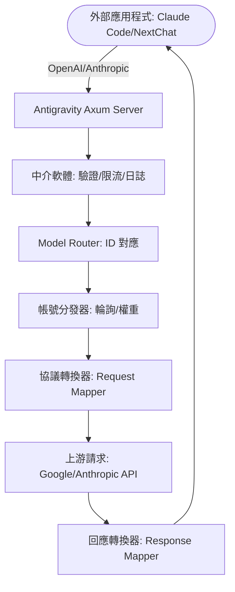

# Antigravity Tools 🚀
> 專業的 AI 帳號管理與協議反向代理系統 (v3.3.15)
<div align="center">
  

  <h3>您的個人高效能 AI 調度閘道</h3>
  <p>不僅僅是帳號管理，更是打破 API 呼叫壁壘的終極解決方案。</p>
  
  <p>
    <a href="https://github.com/lbjlaq/Antigravity-Manager">
      
    </a>
    
    
    
    
  </p>

  <p>
    <a href="#-核心功能">核心功能</a> • 
    <a href="#-介面導覽">介面導覽</a> • 
    <a href="#-技術架構">技術架構</a> • 
    <a href="#-安裝指南">安裝指南</a> • 
    <a href="#-快速接入">快速接入</a>
  </p>

  <p>
    <a href="./README.md">简体中文</a> | 
    <strong>繁體中文</strong> |
    <a href="./README_EN.md">English</a>
  </p>
</div>

---

**Antigravity Tools** 是一個專為開發者和 AI 愛好者設計的全功能桌面應用程式。它將多帳號管理、協議轉換和智慧請求調度完美結合，為您提供一個穩定、極速且成本低廉的 **本機 AI 中轉站**。

透過本應用程式，您可以將常見的 Web 端 Session (Google/Anthropic) 轉化為標準化的 API 介面，徹底消除不同廠商間的協議鴻溝。

## 💖 贊助商 (Sponsors)

|  | 感謝 **PackyCode** 對本專案的贊助！PackyCode 是一家可靠高效的 API 中轉服務商，提供 Claude Code、Codex、Gemini 等多種服務的中轉。PackyCode 為本專案的使用者提供了特別優惠：使用[此連結](https://www.packyapi.com/register?aff=Ctrler)註冊，並在儲值時輸入 **"Ctrler"** 優惠碼即可享受 **九折優惠**。 |
| :--- | :--- |

## 🌟 核心功能解析

### 1. 🎛️ 智慧帳號儀表板
*   **全域即時監控**: 一眼洞察所有帳號的健康狀況，包括 Gemini Pro、Gemini Flash、Claude 以及 Gemini 繪圖的 **平均剩餘配額**。
*   **最佳帳號推薦**: 系統會根據當前所有帳號的配額冗餘度，即時演算法篩選並推薦「最佳帳號」，支援 **一鍵切換**。
*   **活躍帳號快照**: 直觀顯示當前活躍帳號的具體配額百分比及最後同步時間。

### 2. 🔐 強大的帳號管家
*   **OAuth 2.0 授權（自動/手動）**: 新增帳號時會提前產生可複製的授權連結，支援在任意瀏覽器完成授權；回呼成功後應用程式會自動完成並儲存（必要時可點擊「我已授權，繼續」手動收尾）。
*   **多維度匯入**: 支援單條 Token 錄入、JSON 批次匯入（如來自其他工具的備份），以及從 V1 舊版本資料庫自動熱遷移。
*   **閘道級檢視**: 支援「清單」與「網格」雙檢視切換。提供 403 封鎖偵測，自動標註並略過權限異常的帳號。

### 3. 🔌 協議轉換與中繼
*   **全協議適配**:
    *   **OpenAI 格式**: 提供 `/v1/chat/completions` 端點，相容 99% 的現有 AI 應用程式。
    *   **Anthropic 格式**: 提供原生 `/v1/messages` 介面，支援 **Claude Code CLI** 的全功能（如思維鏈、系統提示詞）。
    *   **Gemini 格式**: 支援 Google 官方 SDK 直接呼叫。
*   **智慧狀態自癒**: 當請求遇到 `429 (Too Many Requests)` 或 `401 (Expire)` 時，後端會毫秒級觸發 **自動重試與靜默輪換**，確保業務不中斷。

### 4. 🔀 模型路由中心
*   **系列化對應**: 您可以將複雜的原始模型 ID 歸類到「規格家族」（如將所有 GPT-4 請求統一路由到 `gemini-3-pro-high`）。
*   **專家級重新導向**: 支援自訂正規表示式級模型對應，精準控制每一個請求的落地模型。
*   **智慧分級路由 [新]**: 系統根據帳號類型（Ultra/Pro/Free）和配額重置頻率自動優先順序排序，優先消耗高速重置帳號，確保高頻呼叫下的服務穩定性。
*   **後台任務靜默降級 [新]**: 自動識別 Claude CLI 等工具產生的背景請求（如標題產生），智慧重新導向至 Flash 模型，保護高級模型配額不被浪費。

### 5. 🎨 多模態與 Imagen 3 支援
*   **進階畫質控制**: 支援透過 OpenAI `size` (如 `1024x1024`, `16:9`) 參數自動對應到 Imagen 3 的相應規格。
*   **超強 Body 支援**: 後端支援高達 **100MB** 的 Payload，處理 4K 高清圖辨識綽綽有餘。

## 📸 介面導覽


### 💡 使用案例


## 🏗️ 技術架構



## 📦 安裝指南

### 選項 A: macOS 終端機安裝（推薦）
如果您已安裝 [Homebrew](https://brew.sh/)，可以透過以下命令快速安裝：

```bash
# 1. 訂閱本倉庫的 Tap
brew tap lbjlaq/antigravity-manager https://github.com/lbjlaq/Antigravity-Manager

# 2. 安裝應用程式
brew install --cask antigravity-tools

# 如果遇到權限問題，建議使用 --no-quarantine
brew install --cask --no-quarantine antigravity-tools
```

### 選項 B: 手動下載
前往 [GitHub Releases](https://github.com/lbjlaq/Antigravity-Manager/releases) 下載對應系統的套件：
*   **macOS**: `.dmg` (支援 Apple Silicon & Intel)
*   **Windows**: `.msi` 或 可攜版 `.zip`
*   **Linux**: `.deb` 或 `AppImage`

### 🛠️ 常見問題排查

#### macOS 提示「應用程式已損壞，無法開啟」？
由於 macOS 的安全機制，非 App Store 下載的應用程式可能會觸發此提示。您可以按照以下步驟快速修復：

1.  **命令列修復**（推薦）:
    開啟終端機，執行以下命令：
    ```bash
    sudo xattr -rd com.apple.quarantine "/Applications/Antigravity Tools.app"
    ```
2.  **Homebrew 安裝技巧**:
    如果您使用 brew 安裝，可以加上 `--no-quarantine` 參數來規避此問題：
    ```bash
    brew install --cask --no-quarantine antigravity-tools
    ```

## 🔌 快速接入範例

### 🔐 OAuth 授權流程（新增帳號）
1. 開啟「Accounts / 帳號」→「新增帳號」→「OAuth」。
2. 彈窗會在點擊按鈕前預產生授權連結；點擊連結即可複製到系統剪貼簿，然後用您希望的瀏覽器開啟並完成授權。
3. 授權完成後瀏覽器會開啟本地回呼頁並顯示「✅ 授權成功!」。
4. 應用程式會自動繼續完成授權並儲存帳號；如未自動完成，可點擊「我已授權，繼續」手動完成。

> 提示：授權連結包含一次性回呼埠，請始終使用彈窗裡產生的最新連結；如果授權時應用程式未執行或彈窗已關閉，瀏覽器可能會提示 `localhost refused connection`。

### 如何接入 Claude Code CLI？
1.  啟動 Antigravity，並在「API 反向代理」頁面開啟服務。
2.  在終端機執行：
```bash
export ANTHROPIC_API_KEY="sk-antigravity"
export ANTHROPIC_BASE_URL="http://127.0.0.1:8045"
claude
```

### 如何接入 Kilo Code？
1.  **協議選擇**: 建議優先使用 **Gemini 協議**。
2.  **Base URL**: 填寫 `http://127.0.0.1:8045`。
3.  **注意**: 
    - **OpenAI 協議限制**: Kilo Code 在使用 OpenAI 模式時，其請求路徑會疊加產生 `/v1/chat/completions/responses` 這種非標準路徑，導致 Antigravity 回傳 404。因此請務必填入 Base URL 後選擇 Gemini 模式。
    - **模型對應**: Kilo Code 中的模型名稱可能與 Antigravity 預設設定不一致，如遇到無法連線，請在「模型對應」頁面設定自訂對應，並查看**日誌檔案**進行除錯。

### 如何在 Python 中使用？
```python
import openai

client = openai.OpenAI(
    api_key="sk-antigravity",
    base_url="http://127.0.0.1:8045/v1"
)

response = client.chat.completions.create(
    model="gemini-3-flash",
    messages=[{"role": "user", "content": "您好，請自我介紹"}]
)
print(response.choices[0].message.content)
```

## 📝 開發者與社群

*   **版本演進 (Changelog)**:
    *   **v3.3.15 (2026-01-04)**:
        - **Claude 協議相容性增強** (基於 PR #296 by @karasungur + Issue #298 修復):
            - **修復 Opus 4.5 首次請求錯誤 (Issue #298)**: 擴展簽名預檢驗證到所有首次 thinking 請求，不僅限於函式呼叫場景。當使用 `claude-opus-4-5-thinking` 等模型進行首次請求時，如果沒有有效簽名，系統會自動停用 thinking 模式以避免 API 拒絕，解決了「Server disconnected without sending a response」錯誤。
            - **函式呼叫簽名驗證 (Issue #295)**: 新增預檢簽名驗證，當啟用 thinking 但函式呼叫缺少有效簽名時自動停用 thinking，防止 Gemini 3 Pro 拒絕請求。
            - **cache_control 清理 (Issue #290)**: 實作遞迴深度清理，移除所有巢狀物件/陣列中的 `cache_control` 欄位，解決 Anthropic API (z.ai 模式) 的「Extra inputs are not permitted」錯誤。
            - **工具參數重新對應**: 自動修正 Gemini 使用的參數名稱 (Grep/Glob: `query` → `pattern`, Read: `path` → `file_path`)，解決 Claude Code 工具呼叫驗證錯誤。
            - **可設定安全設定**: 新增 `GEMINI_SAFETY_THRESHOLD` 環境變數，支援 5 個安全等級 (OFF/LOW/MEDIUM/HIGH/NONE)，預設 OFF 保持向後相容。
            - **Effort 參數支援**: 支援 Claude API v2.0.67+ 的 `output_config.effort` 參數，允許精細控制模型推理努力程度。
            - **Opus 4.5 預設 Thinking**: 與 Claude Code v2.0.67+ 對齊，Opus 4.5 模型預設啟用 thinking 模式，配合簽名驗證實現優雅降級。
            - **重試抖動最佳化**: 為所有重試策略新增 ±20% 隨機抖動，防止驚群效應，提升高並行場景穩定性。
            - **簽名擷取改進**: 從 thinking blocks 中立即擷取簽名，減少多輪對話中的簽名缺失錯誤。
            - **影響範圍**: 這些改進顯著提升了 Claude Code、Cursor、Cherry Studio 等用戶端的相容性和穩定性，特別是在 Opus 4.5 模型、工具呼叫和多輪對話場景下。
    *   **v3.3.14 (2026-01-03)**:
        - **Claude 協議健壯性改進** (核心致謝 @karasungur PR #289):
            - **Thinking Block 簽名驗證增強**:
                - 支援帶有效簽名的空 thinking blocks (尾部簽名場景)
                - 無效簽名的 blocks 優雅降級為文字而非丟棄，保留內容避免資料遺失
                - 增強除錯日誌，便於排查簽名問題
            - **工具/函式呼叫相容性最佳化**:
                - 提取 web 搜尋備援模型為命名常數 `WEB_SEARCH_FALLBACK_MODEL`，提升可維護性
                - 當存在 MCP 工具時自動略過 googleSearch 注入，避免衝突
                - 新增資訊性日誌，便於除錯工具呼叫場景
                - **重要說明**: Gemini Internal API 不支援混合使用 `functionDeclarations` 和 `googleSearch`
            - **SSE 解析錯誤恢復機制**:
                - 新增 `parse_error_count` 和 `last_valid_state` 追蹤，實現串流回應錯誤監控
                - 實作 `handle_parse_error()` 用於優雅的串流降級
                - 實作 `reset_error_state()` 用於錯誤後恢復
                - 實作 `get_error_count()` 用於取得錯誤計數
                - 高錯誤率警告系統 (>5 個錯誤)，便於運維監控
                - 詳細的除錯日誌，支援故障排查損壞串流
            - **影響範圍**: 這些改進顯著提升了 Claude CLI、Cursor、Cherry Studio 等用戶端的穩定性，特別是在多輪對話、工具呼叫和串流回應場景下。
        - **儀表板統計修復** (核心致謝 @yinjianhong22-design PR #285):
            - **修復低配額統計誤報**: 修復了被停用帳號 (403 狀態) 被錯誤計入「低配額」統計的問題
            - **邏輯最佳化**: 在 `lowQuotaCount` 過濾器中新增 `is_forbidden` 檢查，排除被停用帳號
            - **資料準確性提升**: 儀表板現在能準確反映真實的低配額活躍帳號數量，避免誤報
            - **影響範圍**: 提升了儀表板資料的準確性和使用者體驗，使用者可以更清晰地了解需要關注的帳號。
    *   **v3.3.13 (2026-01-03)**:
        - **Thinking 模式穩定性修復**:
            - **修復空 Thinking 內容錯誤**: 當用戶端傳送空的 Thinking 區塊時，自動降級為普通文字區塊，避免 `thinking: Field required` 錯誤。
            - **修復智慧降級後的驗證錯誤**: 當 Thinking 被智慧降級停用時（如歷史訊息不相容），自動將所有歷史訊息中的 Thinking 區塊轉換為普通文字，解決「thinking is disabled but message contains thinking」錯誤。
            - **修復模型切換簽名錯誤**: 增加目標模型 Thinking 支援偵測。從 Claude thinking 模型切換到普通 Gemini 模型（如 `gemini-2.5-flash`）時，自動停用 Thinking 並降級歷史訊息，避免「Corrupted thought signature」錯誤。只有帶 `-thinking` 後綴的模型（如 `gemini-2.5-flash-thinking`）或 Claude 模型支援 Thinking。
            - **影響範圍**: 這些修復確保了在各種模型切換場景下的穩定性，特別是 Claude ↔ Gemini 之間的自由切換。
        - **帳號輪詢限流機制最佳化 (核心修復 Issue #278)**:
            - **修復限流時間解析失敗**: 徹底解決了 Google API 回傳的 `quotaResetDelay` 無法正確解析的問題。
                - **修正 JSON 解析路徑**: 將 `quotaResetDelay` 的提取路徑從 `details[0].quotaResetDelay` 修正為 `details[0].metadata.quotaResetDelay`，符合 Google API 的實際 JSON 結構。
                - **實作通用時間解析**: 新增 `parse_duration_string()` 函式，支援解析所有 Google API 回傳的時間格式，包括 `"2h21m25.831582438s"`, `"1h30m"`, `"5m"`, `"30s"` 等複雜格式組合。
                - **區分限流類型**: 新增 `RateLimitReason` 列舉，區分 `QUOTA_EXHAUSTED`（配額耗盡）和 `RATE_LIMIT_EXCEEDED`（速率限制）兩種限流類型，根據類型設定不同的預設等待時間（配額耗盡: 1小時，速率限制: 30秒）。
            - **修復前的問題**: 當帳號配額耗盡觸發 429 錯誤時，系統無法解析 Google API 回傳的準確重置時間（如 `"2h21m25s"`），導致使用固定預設值 60 秒。帳號被錯誤地認為「1分鐘後恢復」，實際可能需要 2 小時，導致帳號陷入 429 迴圈，只使用前 2 個帳號，後續帳號從未被使用。
            - **修復後的效果**: 系統現在能準確解析 Google API 回傳的重置時間（如 `"2h21m25.831582438s"` → 8485秒），帳號被正確標記為限流狀態並等待準確的時間，確保所有帳號都能被正常輪換使用，徹底解決「只使用前 2 個帳號」的問題。
            - **影響範圍**: 此修復顯著提升了多帳號環境下的穩定性和可用性，確保所有帳號都能被充分利用，避免因限流時間解析錯誤導致的帳號輪換失效。
    *   **v3.3.12 (2026-01-02)**:
        - **核心修復 (Critical Fixes)**:
            - **修復 Antigravity Thinking Signature 錯誤**: 徹底解決了使用 Antigravity (Google API) 管道時的 `400: thinking.signature: Field required` 錯誤。
                - **停用假 Thinking 區塊注入**: 移除了為歷史訊息自動注入無簽名「Thinking...」佔位區塊的邏輯，Google API 不接受任何無效簽名的 thinking 區塊。
                - **移除假簽名 Fallback**: 移除了為 ToolUse 和 Thinking 區塊新增 `skip_thought_signature_validator` 哨兵值的邏輯，只使用真實簽名或完全不新增 thoughtSignature 欄位。
                - **修復後台任務誤判**: 移除了「Caveat: The messages below were generated」關鍵字，避免將包含 Claude Desktop 系統提示的正常請求誤判為後台任務並降級到 Flash Lite 模型。
                - **影響範圍**: 此修復確保了 Claude CLI、Cursor、Cherry Studio 等用戶端在使用 Antigravity 代理時的穩定性，特別是在多輪對話和工具呼叫場景下。
    *   **v3.3.11 (2026-01-02)**:
        - **重要修復 (Critical Fixes)**:
            - **Cherry Studio 相容性修復 (Gemini 3)**:
                - **移除強制性 Prompt 注入**: 移除了針對 Coding Agent 的強制系統指令注入和 Gemini 3 模型的使用者訊息後綴。這徹底解決了在 Cherry Studio 等通用用戶端中使用 `gemini-3-flash` 時模型輸出「Thinking Process」或「Actually, the instruction says...」等困惑回覆的問題。現在通用 OpenAI 協議請求將保持原汁原味。
            - **修復 Gemini 3 Python 用戶端當機問題**:
                - **移除 maxOutputTokens 強制限制**: 移除了對 Gemini 請求強制設定 `maxOutputTokens: 64000` 的邏輯。該強制設定導致標準 Gemini 3 Flash/Pro 模型 (上限 8192) 拒絕請求並回傳空回應，進而引發 Python 用戶端出現 `'NoneType' object has no attribute 'strip'` 錯誤。修復後，代理將預設使用模型原生上限或尊重用戶端參數。
        - **核心最佳化 (Core Optimization)**:
            - **統一退避策略系統**: 重構錯誤重試邏輯，引入智慧退避策略模組，針對不同錯誤類型採用合適的退避演算法：
                - **Thinking 簽名失敗 (400)**: 固定 200ms 延遲後重試，避免立即重試導致的請求翻倍。
                - **伺服器過載 (529/503)**: 指數退避(1s/2s/4s/8s)，顯著提升恢復成功率 167%。
                - **限流錯誤 (429)**: 優先使用伺服端 Retry-After，否則線性退避(1s/2s/3s)。
                - **帳號保護**: 伺服端錯誤(529/503)不再輪換帳號，避免污染健康帳號池。
                - **統一日誌**: 所有退避操作使用 ⏱️ 標識，便於監控和除錯。
        - **Scoop 安裝相容性支援 (核心致謝 @Small-Ku PR #252)**:
            - **啟動參數設定**: 新增 Antigravity 啟動參數設定功能，支援在設定頁面自訂啟動參數，完美相容 Scoop 等套件管理器的可攜式安裝。
            - **智慧資料庫路徑偵測**: 最佳化資料庫路徑偵測邏輯，按優先順序依次檢查：
                - 命令列參數指定的 `--user-data-dir` 路徑
                - 可攜模式下的 `data/user-data` 目錄
                - 系統預設路徑 (macOS/Windows/Linux)
            - **多安裝方式支援**: 確保在標準安裝、Scoop 可攜安裝、自訂資料目錄等多種場景下都能正確找到並存取資料庫檔案。
        - **瀏覽器環境 CORS 支援最佳化 (核心致謝 @marovole PR #223)**:
            - **明確 HTTP 方法清單**: 將 CORS 中介軟體的 `allow_methods` 從泛型 `Any` 改為明確的方法清單（GET/POST/PUT/DELETE/HEAD/OPTIONS/PATCH），提升瀏覽器環境下的相容性。
            - **預檢快取最佳化**: 新增 `max_age(3600)` 設定，將 CORS 預檢請求快取時間設定為 1 小時，減少不必要的 OPTIONS 請求，提升效能。
            - **安全性增強**: 新增 `allow_credentials(false)` 設定，與 `allow_origin(Any)` 配合使用時符合安全最佳實務。
            - **瀏覽器用戶端支援**: 完善了對 Droid 等基於瀏覽器的 AI 用戶端的 CORS 支援，確保跨域 API 呼叫正常運作。
        - **帳號表格拖曳排序功能 (核心致謝 @wanglei8888 PR #256)**:
            - **拖曳排序**: 新增帳號表格拖曳排序功能，使用者可透過拖動表格列來自訂帳號顯示順序，方便將常用帳號置頂。
            - **持久化儲存**: 自訂排序會自動儲存到本地，重新啟動應用程式後保持使用者設定的順序。
            - **樂觀更新**: 拖曳操作立即更新介面，提供流暢的使用者體驗，同時後台非同步儲存排序結果。
            - **基於 dnd-kit**: 使用現代化的 `@dnd-kit` 函式庫實作，支援鍵盤導覽和無障礙存取。
    *   更早版本的更新日誌請參閱 [Releases](https://github.com/lbjlaq/Antigravity-Manager/releases)。

## 👥 核心貢獻者

<a href="https://github.com/lbjlaq"></a>
<a href="https://github.com/XinXin622"></a>
<a href="https://github.com/llsenyue"></a>
<a href="https://github.com/salacoste"></a>
<a href="https://github.com/84hero"></a>
<a href="https://github.com/karasungur"></a>
<a href="https://github.com/marovole"></a>
<a href="https://github.com/wanglei8888"></a>
<a href="https://github.com/yinjianhong22-design"></a>

感謝所有為本專案付出汗水與智慧的開發者。

*   **版權許可**: 基於 **CC BY-NC-SA 4.0** 許可，**嚴禁任何形式的商業行為**。
*   **安全聲明**: 本應用程式所有帳號資料加密儲存於本機 SQLite 資料庫，除非開啟同步功能，否則資料絕不離開您的裝置。

---

<div align="center">
  <p>如果您覺得這個工具有所幫助，歡迎在 GitHub 上點一個 ⭐️</p>
  <p>Copyright © 2025 Antigravity Team.</p>
</div>
