# Antigravity Tools 🚀
> 專業的 AI 帳號管理與協議反向代理系統 (v3.3.15)
<div align="center">
  

  <h3>您的個人高效能 AI 調度閘道</h3>
  <p>不僅僅是帳號管理，更是打破 API 呼叫壁壘的終極解決方案。</p>
  
  <p>
    <a href="https://github.com/lbjlaq/Antigravity-Manager">
      
    </a>
    
    
    
    
  </p>

  <p>
    <a href="#-核心功能">核心功能</a> • 
    <a href="#-介面導覽">介面導覽</a> • 
    <a href="#-技術架構">技術架構</a> • 
    <a href="#-安裝指南">安裝指南</a> • 
    <a href="#-快速接入">快速接入</a>
  </p>

  <p>
    <a href="./README.md">简体中文</a> | 
    <strong>繁體中文</strong> |
    <a href="./README_EN.md">English</a>
  </p>
</div>

---

**Antigravity Tools** 是一個專為開發者和 AI 愛好者設計的全功能桌面應用程式。它將多帳號管理、協議轉換和智慧請求調度完美結合，為您提供一個穩定、極速且成本低廉的 **本機 AI 中轉站**。

透過本應用程式，您可以將常見的 Web 端 Session (Google/Anthropic) 轉化為標準化的 API 介面，徹底消除不同廠商間的協議鴻溝。

## 🌟 核心功能解析

### 1. 🎛️ 智慧帳號儀表板
*   **全域即時監控**: 一眼洞察所有帳號的健康狀況，包括 Gemini Pro、Gemini Flash、Claude 以及 Gemini 繪圖的 **平均剩餘配額**。
*   **最佳帳號推薦**: 系統會根據當前所有帳號的配額冗餘度，即時演算法篩選並推薦「最佳帳號」，支援 **一鍵切換**。
*   **活躍帳號快照**: 直觀顯示當前活躍帳號的具體配額百分比及最後同步時間。

### 2. 🔐 強大的帳號管家
*   **OAuth 2.0 授權（自動/手動）**: 新增帳號時會提前生成可複製的授權連結，支援在任意瀏覽器完成授權。
*   **多維度匯入**: 支援單條 Token 錄入、JSON 批次匯入，以及從 V1 舊版本資料庫自動熱遷移。
*   **閘道級檢視**: 支援「清單」與「網格」雙檢視切換。提供 403 封鎖偵測，自動標註並略過權限異常的帳號。

### 3. 🔌 協議轉換與中繼
*   **全協議適配**:
    *   **OpenAI 格式**: 提供 `/v1/chat/completions` 端點，相容 99% 的現有 AI 應用程式。
    *   **Anthropic 格式**: 提供原生 `/v1/messages` 介面，支援 **Claude Code CLI** 的全功能。
    *   **Gemini 格式**: 支援 Google 官方 SDK 直接呼叫。
*   **智慧狀態自癒**: 當請求遇到 `429` 或 `401` 時，後端會毫秒級觸發 **自動重試與靜默輪換**，確保業務不中斷。

### 4. 🔀 模型路由中心
*   **系列化對應**: 您可以將複雜的原始模型 ID 歸類到「規格家族」（如將所有 GPT-4 請求統一路由到 `gemini-3-pro-high`）。
*   **專家級重新導向**: 支援自訂正規表示式級模型對應，精準控制每一個請求的落地模型。
*   **後台任務靜默降級**: 自動識別 Claude CLI 等工具產生的背景請求，智慧重新導向至 Flash 模型，保護高級模型配額不被浪費。

### 5. 🎨 多模態與 Imagen 3 支援
*   **進階畫質控制**: 支援透過 OpenAI `size` 參數自動對應到 Imagen 3 的相應規格。
*   **超強 Body 支援**: 後端支援高達 **100MB** 的 Payload，處理 4K 高清圖辨識綽綽有餘。

## 📸 介面導覽


## 🏗️ 技術架構

```mermaid
graph TD
    Client([外部應用程式: Claude Code/NextChat]) -->|OpenAI/Anthropic| Gateway[Antigravity Axum Server]
    Gateway --> Middleware[中介軟體: 驗證/限流/日誌]
    Middleware --> Router[Model Router: ID 對應]
    Router --> Dispatcher[帳號分發器: 輪詢/權重]
    Dispatcher --> Mapper[協議轉換器: Request Mapper]
    Mapper --> Upstream[上游請求: Google/Anthropic API]
    Upstream --> ResponseMapper[回應轉換器: Response Mapper]
    ResponseMapper --> Client
```



## 📦 安裝指南

### 選項 A: macOS 終端機安裝（推薦）
```bash
# 1. 訂閱本倉庫的 Tap
brew tap lbjlaq/antigravity-manager https://github.com/lbjlaq/Antigravity-Manager

# 2. 安裝應用程式
brew install --cask antigravity-tools

# 如果遇到權限問題，建議使用 --no-quarantine
brew install --cask --no-quarantine antigravity-tools
```

### 選項 B: 手動下載
前往 [GitHub Releases](https://github.com/lbjlaq/Antigravity-Manager/releases) 下載對應系統的套件：
*   **macOS**: `.dmg` (支援 Apple Silicon & Intel)
*   **Windows**: `.msi` 或 可攜版 `.zip`
*   **Linux**: `.deb` 或 `AppImage`

### 🛠️ 常見問題排查

#### macOS 提示「應用程式已損壞，無法開啟」？
1.  **命令列修復**（推薦）:
    ```bash
    sudo xattr -rd com.apple.quarantine "/Applications/Antigravity Tools.app"
    ```

## 🔌 快速接入範例

### 如何接入 Claude Code CLI？
1.  啟動 Antigravity，並在「API 反向代理」頁面開啟服務。
2.  在終端機執行：
```bash
export ANTHROPIC_API_KEY="sk-antigravity"
export ANTHROPIC_BASE_URL="http://127.0.0.1:8045"
claude
```

### 如何在 Python 中使用？
```python
import openai

client = openai.OpenAI(
    api_key="sk-antigravity",
    base_url="http://127.0.0.1:8045/v1"
)

response = client.chat.completions.create(
    model="gemini-3-flash",
    messages=[{"role": "user", "content": "您好，請自我介紹"}]
)
print(response.choices[0].message.content)
```

## 👥 核心貢獻者

<a href="https://github.com/lbjlaq"></a>
<a href="https://github.com/XinXin622"></a>
<a href="https://github.com/llsenyue"></a>
<a href="https://github.com/salacoste"></a>
<a href="https://github.com/84hero"></a>
<a href="https://github.com/karasungur"></a>

感謝所有為本專案付出汗水與智慧的開發者。

*   **版權許可**: 基於 **CC BY-NC-SA 4.0** 許可，**嚴禁任何形式的商業行為**。
*   **安全聲明**: 本應用程式所有帳號資料加密儲存於本機 SQLite 資料庫，除非開啟同步功能，否則資料絕不離開您的裝置。

---

<div align="center">
  <p>如果您覺得這個工具有所幫助，歡迎在 GitHub 上點一個 ⭐️</p>
  <p>Copyright © 2025 Antigravity Team.</p>
</div>
